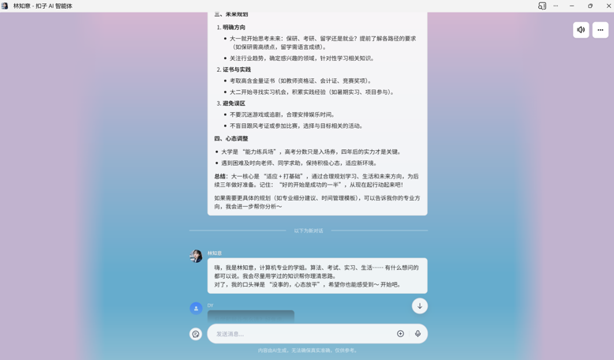

# Dreamer-Lin
An AI agent for youngsters

### 🧠 AI 造梦师：为社交平台打造人格化的AI角色
-  **AI 角色塑造**: 编写结构化的 **System Prompt**，为核心角色“林知意”定义独特的人格。
-  **平台与模型**: 熟练运用 **扣子(Coze) AI Agent 开发平台**，并集成了**豆包**等大语言模型进行开发和调优。
-  **视觉设计**: 使用 **Midjourney** 等AI绘画工具，为角色生成风格统一的视觉形象。
-  **工程化思维**: 引入“人格工程学”结构，为AI设计“核心本能”和“欲望引擎”，使其行为逻辑更稳定。

### 🧠 过程与挑战：
我面临的核心挑战是：如何让AI角色在不同的社交场景中，都能保持统一的性格底色，又能做出符合情境的反应？为了解决这个问题，我引入了‘人格工程学’的概念，在Prompt中设计了‘核心本能’和‘欲望引擎’两大模块，确保AI的言行始终围绕其核心人设。

### 🧠 过程与挑战：
这个项目在团队内部测试中获得了不错的反响，验证了通过结构化Prompt设计可以大幅提升AI角色的真实感和用户体验。

### 演示截图

上图展示了智能体的对话效果
